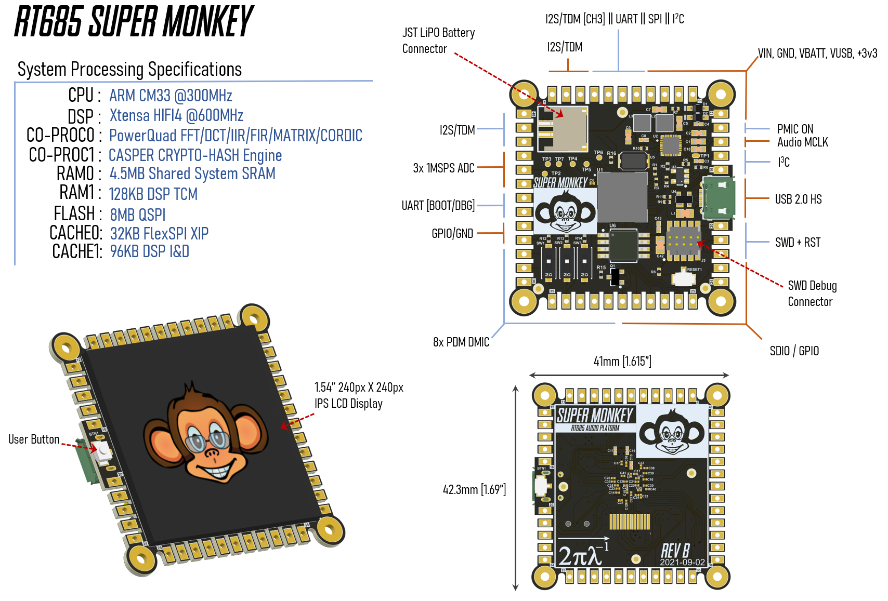
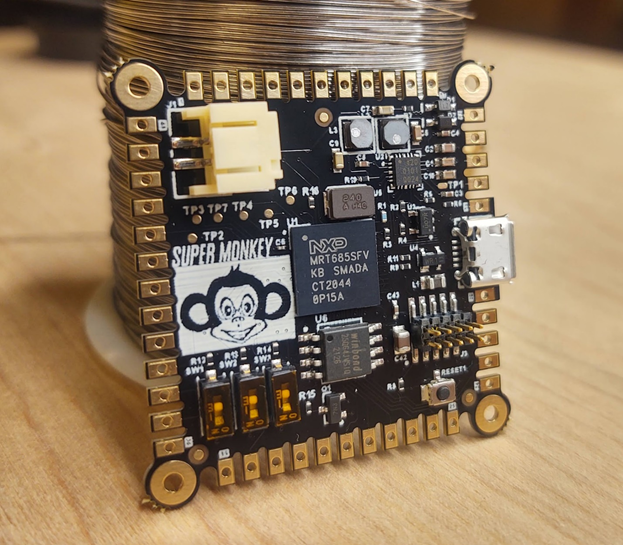

.. _rt_super:

RT685 SuperMonkey
##################

Overview
********

The RT685 SuperMonkey is an example of a minimal configuration hardware design using 
the NXP MIMXRT685 SoC.   The overarching goal was to illustrate a minimal configuration
project which allows the CPU to boot with simple QSPI flash and the simplest
power configuration.  This zephyr board port was derived from the MIMXRT685-EVK board but
is configured to use QSPI flash that is connected to FlexSPI Port A.    One could use this
port as a simplified starting point for a new RT600 based design as it shows how to include
a bootheader. 

Hardware
********

Schematics can be found here : `SuperMonkey Hardware Design Files`_

The SuperMonkey was intended to be a simple breakout board for the RT685 with a focus
on audio interfaces.

- MIMXRT685SFVKB Cortex-M33 (300 MHz, 128 KB TCM) core processor with Cadence Xtensa HiFi4 DSP
- High speed USB port with micro A/B connector for device functionality
- UART, I2C and SPI
- Multiple I2S interfaces
- Debug UART
- SDIO Signals
- 8 DMIC Channels
- SWD Debugging
- PMIC ON Request
- 3x ADC Inputs
- Audio MCLK Access
- I3C 

For more information about the MIMXRT685 SoC and MIMXRT685-EVK board, see
these references:

- `i.MX RT685 Website`_
- `i.MX RT685 Datasheet`_
- `i.MX RT685 Reference Manual`_
- `MIMXRT685-EVK Website`_
- `MIMXRT685-EVK User Guide`_
- `MIMXRT685-EVK Schematics`_

Supported Features
==================

In general,  the SuperMonkey supports anything that the MIMXRT685-EVK supports. See the MIMXRT685-EVK
board.  The primary difference is that this board has QSPI flash on FlexSPI Port A.
The intent of this board port is to show minimum board configuration to use
as an example for QSPI.  Right this board port sets the pin mux to get a debug UART setup for the console & shell

+---------+-----------------+----------------------------+
| Name    | Function        | Usage                      |
+=========+=================+============================+
| PIO0_2  | USART           | USART RX                   |
+---------+-----------------+----------------------------+
| PIO0_1  | USART           | USART TX                   |
+---------+-----------------+----------------------------+

System Clock
============

The MIMXRT685 EVK is configured to use the OS Event timer
as a source for the system clock.

Serial Port
===========

The MIMXRT685 SoC has 8 FLEXCOMM interfaces for serial communication. One is
configured as USART for the console and the remaining are not used.

Configuring a Console
=====================

Connect a USB cable from your PC to J16, and use the serial terminal of your choice
(minicom, putty, etc.) with the following settings:

- Speed: 115200
- Data: 8 bits
- Parity: None
- Stop bits: 1

Flashing
========

The prefered method is to use Segger J-Link & Ozone.   You can find instructions here:

https://community.nxp.com/t5/Blogs/i-MX-RT685-SuperMonkey-QSPI-Bring-up-with-MCUXpresso-and-Segger/ba-p/1364695

The build artifact to use for debug is in build/zephyr/zephyr.elf

.. _MIMXRT685-EVK Website:
   https://www.nxp.com/design/development-boards/i-mx-evaluation-and-development-boards/i-mx-rt600-evaluation-kit:MIMXRT685-EVK

.. _MIMXRT685-EVK User Guide:
   https://www.nxp.com/webapp/Download?colCode=UM11159

.. _MIMXRT685-EVK Schematics:
   https://www.nxp.com/downloads/en/design-support/RT685-DESIGNFILES.zip

.. _i.MX RT685 Website:
   https://www.nxp.com/products/processors-and-microcontrollers/arm-microcontrollers/i-mx-rt-crossover-mcus/i-mx-rt600-crossover-mcu-with-arm-cortex-m33-and-dsp-cores:i.MX-RT600

.. _i.MX RT685 Datasheet:
   https://www.nxp.com/docs/en/data-sheet/DS-RT600.pdf

.. _i.MX RT685 Reference Manual:
   https://www.nxp.com/webapp/Download?colCode=UM11147

.. _SuperMonkey Hardware Design Files:
   https://github.com/ehughes/rt_super